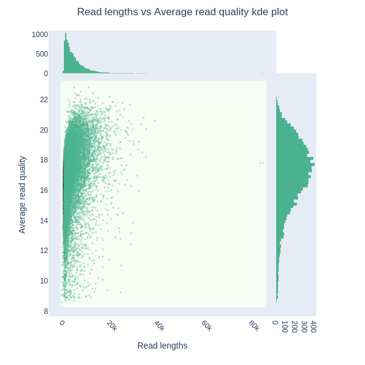
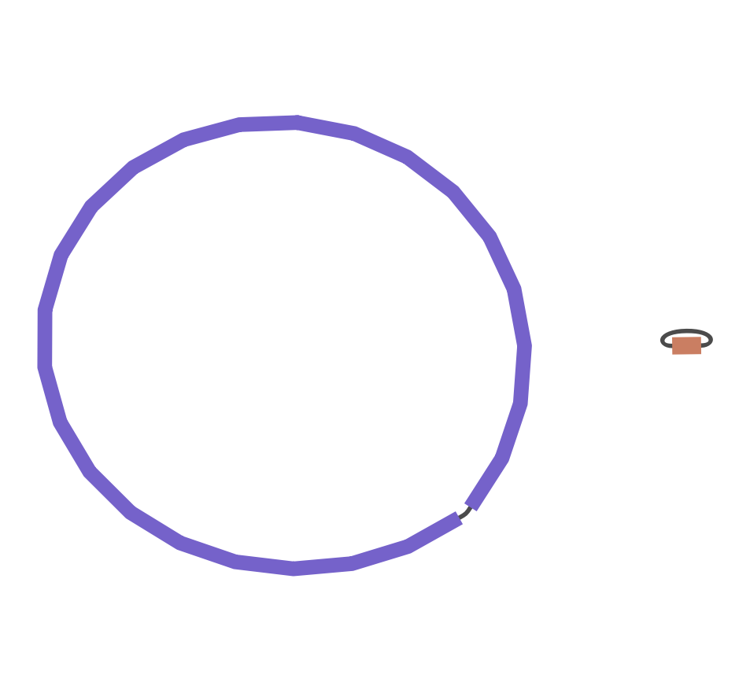
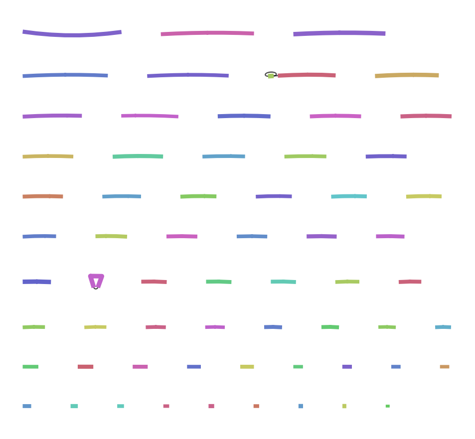

# Nanopore Data Assembly Tutorial

This tutorial will guide you through the process of filtering, assembling, circularizing, and annotating nanopore sequencing data using various bioinformatics tools. The tools used in this tutorial are:

- **NanoPlot** to produce quality plots and reports of the raw reads.
- **NanoFilt** to filter low-quality and short reads.
- **Flye** for the _de novo_ assembly of long reads.
- **Racon** to polish the  initial assembly.
- **BUSCO** to assess the quality of the assembly.
- **DNAapler** to reorient the circularized assembly.
- **Prokka** to annotate the assembled genome.
- **Unicycler** allows to do a hybrid assembly based on short accurate reads.

## Prerequisites

Before starting, ensure that you are able to access the ERDA workgroup and follow the next steps to install all the tools that we will use:

1. Access ERDA workgroup [link](https://sid.erda.dk/cgi-sid/ls.py?share_id=ePr2eWTdSX).

2. Download from the ERDA workgroup the raw *Bacillus subtilis* and *Echerichia coli* C-1 sequencing data.
   
3. Download from the ERDA workgroup the file course.yaml

4. Install the conda environment: `mamba install -f course.yaml`

5. Install [Unicycler](https://github.com/rrwick/Unicycler?tab=readme-ov-file#installation) and [Racon](https://github.com/lbcb-sci/racon?tab=readme-ov-file#installation).


#### Tools installation
The first step, even before processing any data is to prepare the working environment. In bioinformatics, an organized workspace is vital, so when you come after some time to your project, you can find and understand whant you were doing, rather thatn spend hours searching through weirldy named directories. It is inportant to always create three directories:

- scripts: all the scripts will be stored here, with meaningful names
- data: Raw data will go in here and, if you want and need, databases
- results: Create a sub directory for every different process you do. If you run a process multiple times with different parameters, include them in the directory name, so you will differenciate them in the future.

```bash
mkdir scripts
mkdir data
mkdir -p results/bsubtilis
mkdir -p results/ecoli
```

Most of the tools can be installed directly using a conda environment. Conda environments are powerful options to install multiple programs avoiding compatibility issues. In this case, we will use mamba, which is a version of conda more powerful when multiple software has too be installed. 

```bash
wget https://sid.erda.dk/share_redirect/ePr2eWTdSX/course.yaml
mamba env create -f course.yaml
```

Unicycler and Racon are installed using the commands in their wikis. For their isntallation, I would recommend creating a new directory called programs, so they are more accessible and our main environment does not get full of unnecesary files.

```bash
# Install Unicycler
sudo apt install Uni

# Racon install
sudo apt install racon
```

The final tool that you should install is called [Bandage](https://github.com/rrwick/Bandage), which is a GUI programs that allows the interaction and visualization of the graphs made by most *de novo* assemblers. The easiest way to install and use, in my opinion, would be to install it in your normal machine (Windows or Mac) and visuallize the files directly from there. Do not worry, because these files are not big, so you memory won't magically disappear.

#### Data download

Now, with the main directories created and the tools installed, lets download the data. It has all been placed on an ERDA workgroup, as mentioned above, with the intermediate files, in case any step fails to work. To begin with, download the *Bacillus subtitlis* raw long reads, which will be used for the first part of the tutorial:

```bash
mkdir data/bsubtilis
cd data/bsubtilis
wget https://sid.erda.dk/share_redirect/ePr2eWTdSX/data/bsubtilis/bsubtilis_long_reads.fastq
cd ../..
```

Also, lets download from ERDA the *Echerichia coli* sequencig data. It constists of three files, one with the long ONT reads, and two with the short accurate Illumina reads. They are split in two files since it comes from a Paired End sequencing approach, with the foward and reverse reads.

```bash
mkdir data/ecoli
cd data/ecoli

wget https://sid.erda.dk/share_redirect/ePr2eWTdSX/data/ecoli/illumina_f.fq
wget https://sid.erda.dk/share_redirect/ePr2eWTdSX/data/ecoli/illumina_r.fq
wget https://sid.erda.dk/share_redirect/ePr2eWTdSX/data/ecoli/minion_2d.fq

cd ../..
```
Moreover, the data that we will use in this tutorial is publicly available in [NCBI](https://trace.ncbi.nlm.nih.gov/Traces/?view=run_browser&acc=SRR29816488&display=metadata) and in [Zenodo](https://zenodo.org/records/940733),

# Long reads only assembly and annotation

For the first part of the turotial, we will perform a long-reads only assembly and annotation, using the *Bacillus subtilis* NCBI dataset. The *Escherichia coli* dataset will be used for a hybrid assembly further on.

## Step 1: Quality control and filtering

The initial step in any pipeline that works with sequencing data is to ensure the correct quality of the dataset. For that, we will use a tool like `NanoPlot` to check for different parameters, such as read quality and length, as well as read number. 

````bash
NanoPlot --fastq data/bsubtilis/bsubtilis_long_reads.fastq -o results/bsubtilis/qc
````

NanoQC produces multiple input files, wich showcase the different aspects of the sequencing run. One of the most importants is the graph of length vs quality of the reads:

<p align="center">
  
  <br>
  <em>Figure 1: Scatter plot of the read length vs average read quality.</em>
</p>

Once the initial quality has been assessed, filtering out short and low-quality reads is a crucial step in the assembly process. Reads that are under 1,000 base pairs in length can introduce noise, leading to a less accurate assembly. Additionally, reads with a quality score lower than 10 may contain sequencing errors, which can further compromise the accuracy of the assembly.

To achieve this, we use `NanoFilt` to filter the reads. `NanoFilt`  processes the data, filtering out any reads shorter than 1,000 base pairs or with a quality score below 12, resulting in a cleaner dataset for downstream analysis. In this dataset, this would be the optimal filtering. 1000bp is chosen because `Flye` will produce significantly worse contigs if there are reads under that size, and the quality threshold of 12 is to eliminate the tail of reads that have the lowest quality, without having a great impact in the size of the sequencing data.

```bash
# Create target directory
mkdir -p results/bsubtilis/filtered
# Run the filtering
NanoFilt -l 1000 -q 12 data/bsubtilis/bsubtilis_long_reads.fastq > results/bsubtilis/filtered/bsubtilis_long_reads_filtered.fastq
```

 ## Step 2: Assemble the reads

We will use `Flye`, a *de novo* assembler for long reads. It is designed for a wide range of datasets, and it has several parameters that will have to specify to obtain the most optimal assembly. First of all, we have to indicate the type of input we are using, `nano-raw` in our case, since we have regular uncorrected nanopore reads. Also, it is important to specify genome size, so `Flye` know's what to expect and can estimate the correct depth of sequencing and act accordingly.

```bash 
flye --nano-raw results/bsubtilis/filtered/bsubtilis_long_reads_filtered.fastq \
    -t 8 \
    -o results/bsubtilis/assembly \
    --genome-size 4300000
```

There is another useful option in `Flye`, which is `asm-coverage`, where you can indicate the desired covereage you want in your assembly and it will automatically subset your input to meet the requirement. This might be useful in cases where there is too much information (over 100x), which will slow down the process and might lead `Flye` to produce errors.

`Flye` produces as ouptut multiple files, such as the final assembly (assembly.fasta) and the assembly graphs. The assembly graphs are indicators of how good the assembly was done, and if it went accordingly. The graphs can be visualized using Bandage. If we are assembling an isolate, ideally we would like to see one big circular fragment, the chromosome, with some smaller circular or linear fragments (plasmids)

<p align="center">
  
  <br>
  <em>Figure 2: Good assemvly graph with a circular chromosome and a plasmid.</em>
</p>

<p align="center">
  
  <br>
  <em>Figure 3: Bad assembly with no circular chromosome. there are a lot of non-contiguous contigs, really fragmented. </em>
</p>

 ## Step 3: Quality assesment

There are many ways in which the quality of an assembly can be determined. We can focus on the lenght, depth and size of the contigs in the assembly, by looking at several parameters:

1. Number of fragments: Ideally we want a low number of fragments (chromosome + several plasmids)

2. Assembly size: It should be at least of 95% of the expected length.
3. N50: Sequence length of the shortest contig that contains 50% of the bases in the assembly
4. N90: Sequence length of the shortest contig that contains 90% of the bases in the assembly
5. GC content: Percentage of Guanine and Citosine nucleotides in the assembly (isolate dependant)
6. Completness of genes: If the origin of the isolate is known, it can be compared with the genes of the reference to determine the percentage of missing genes. If no reference is available, tools like CheckM2 search for a number of known core single-copy bacterial genes to assess the quality of the assembly.
7. Contamination: Tools like CheckM can assess if an isolate has been contaminated with other genomes

A fair approach is to use [BUSCO](https://busco.ezlab.org/) in ordert to assess the quality of an assembly. BUSCO will look for a set of genes, after autodetecting the lineage of the assembly (it can be manually given) and determine the percentage of complete, duplicated, missing or broken genes. 

In order to find out if our lineage is present, you can run the following command: `busco --list-datasets`. This will output a list of the different lineage datasets that are inside of `BUSCO`'s database. In our case, we will select 'bacillales_odb10'.

```bash
busco -i results/bsubtilis/assembly/assembly.fasta -m genome \
   -l bacillales_odb10 -o results/bsubtilis/busco_flye
```

`BUSCO` will produce a long log accompanied by multiple files, with a quantitative assessment of the completeness of the assembly. The main focus is on gene content, divided in multiple categories based onthe gene count. Further information can be found in their [manual](https://busco.ezlab.org/busco_userguide.html#interpreting-the-results).

 ## Step 4: Polish the assembly

 As it has been mentioned, long reads tend to have more errors during sequencing than short reads. Thus it is highly important to include a polishing step inside of the assembly pipeline, to reduce the number of errors that might be intruduced as sequencing biases. For this goal we use `Racon`, which uses either the original set of long reads or can be combined with short accurate data (what is known as a hybrid assembly and will be discussed further on). `Racon` takes three files as input:

 1. Original or short accurate reads
 2. Mapped reads against the assembly (PAF format)
 3. Assembly to be corrected

To do the mapping we will use `minimap2`:

```bash
minimap2 -x map-ont results/bsubtilis/circularized.fasta \
    results/bsubtilis/filtered/bsubtilis_long_reads_filtered.fastq \
    -t 8 > results/bsubtilis/assembly/bsubtilis_mapped.paf
```

Once the reads are mapped against the assembly `Racon` can begin the polishing. Take into account that the input files have to be given in a specific order, given in the list above.

```bash
mkdir -p results/bsubtilis/polished

racon results/bsubtilis/filtered/bsubtilis_long_reads_filtered.fastq \
    results/bsubtilis/assembly/bsubtilis_mapped.paf \
    results/bsubtilis/assembly/assembly.fasta  -t 8 > results/bsubtilis/polished/bsubtilis_racon.fasta
```

***Disclaimer:*** Some recent papers have found that with the newest upgrades to ONT sequencing, the read quality is good enought that the assemblies might not need a polishing step, and it would even hinder the results. However, nothing is confirmed, and it is always a good practice to check your assembly before and after polishing if you have a good reference. In our case, by `Racon` output, we can see that a small fraction of the genome is corrected, which is an improvement.

With that in mind, lets run busco on the polished assembly and look at the results:

```bash
busco -i results/bsubtilis/polished/bsubtilis_racon.fasta -m genome \
   -l bacillales_odb10 -o results/bsubtilis/busco_polished
```

1. Raw assembly:

        --------------------------------------------------
        |Results from dataset bacillales_odb10            |
        --------------------------------------------------
        |C:99.8%[S:99.6%,D:0.2%],F:0.2%,M:0.0%,n:450      |
        |449    Complete BUSCOs (C)                       |
        |448    Complete and single-copy BUSCOs (S)       |
        |1      Complete and duplicated BUSCOs (D)        |
        |1      Fragmented BUSCOs (F)                     |
        |0      Missing BUSCOs (M)                        |
        |450    Total BUSCO groups searched               |
        --------------------------------------------------
2. Polished assembly:

        --------------------------------------------------
        |Results from dataset bacillales_odb10            |
        --------------------------------------------------
        |C:99.3%[S:99.1%,D:0.2%],F:0.7%,M:0.0%,n:450      |
        |447    Complete BUSCOs (C)                       |
        |446    Complete and single-copy BUSCOs (S)       |
        |1      Complete and duplicated BUSCOs (D)        |
        |3      Fragmented BUSCOs (F)                     |
        |0      Missing BUSCOs (M)                        |
        |450    Total BUSCO groups searched               |
        --------------------------------------------------

As you can see, the polished assembly is slightly worse 

 ## Step 5: Circularize the assembly

Once the assembly is done and we determined the best pipeline, the first contig will contain our chromosome. By consensus, the bacterial chromosomes have to be oriented so the first gene present is the origin of replication (dnaA in most cases). That way, different assemblies of the same genome can be compared between them (otherwise the genes would have different positons!). For that purpose, we use a circularizer tool, such as dnaapler. It will search for any origin of replication genes of both genomes and plasmids and then alter the contigs so these are the first positions.

```bash
dnaapler all -i results/bsubtilis/assembly/assembly.fasta \
    -o results/bsubtilis/circularization \
    -t 8
# Moving the main assembly to the outter directory
cp results/bsubtilis/circularization/dnaapler_reoriented.fasta results/bsubtilis/final_assembly.fasta
```

## Step 6: Annotate the assembly

The final step in this pipeline is the annotation. This process consists of two disticnt phases: calling the Open Reading Frames (ORFs) and then assigning a function to them. An ORF is found by determine regions in the genome that begin with an start codon and are closed with a stop codon. Each of this sequences will be putative proteins, which are compared against a gene database to assign known functions to each one of them. Depending on the database used, we will recover some genes and miss others, so it is a good practice to try and run our annotation on a more specific database if we are looking for a specific function (such as a CAZy database or ncRNA).

```bash
prokka --outdir results/bsubtilis/annotation \
    --prefix bsubtilis \
    --genus Bacillus \
    --cpus 8 \
    results/bsubtilis/final_assembly.fasta
```

 ## Excercise

 Following and using all the information you have up intil now, try to assembly the _Escherichia coli_ C-1 genome using only the long reads given. Go step by step and decide on the previously discussed parameters. At every milestone, look at the output files and decide if it is worth continuing or something has gone wrong.
 
 ## Step Extra: Hybrid assembly

 Nanopore technologies have great strength when it comes to resolving repeats and structural variants due to their long size. However, they come with the caveat of a reduced accuarcy when compared with short reads. This can be compensated by a high throughput, that will correct most of the errors. 

 Another method to solve the error rate issue from long reads is to combine the power of both short and long reads by performing a hybrid assembly. There are multiple ways in which this process can be done, but the most common is to perform a initial assembly with long reads and then polish it using the short reads. To do this, the short reads are aligned to the long read assembly and then, errors are corrected.

 We have already talked about polishing a long-read assembly by using short accurate reads, with a tool like `Racon`. Now, its time to look at the other approach, to first build a short-reads assembly and then resolve the repetitive regions using long reads. For this step, we will use the assembler `Unicycler`. It combines a short read assembly done by `Spades` using different graph approaches, which will be combined to produce one final polished assembly. That assembly will contain loops in the graph that are unresolved, and cannot be resolved using only short reads. Thus, long reads are used to find the most supported path in the repetitive regions, eliminating the ambiguosity.

<p align="center">
  
  <br>
  <em>Figure 4: Unicycler hybrid assembly approach.</em>
</p>

With all of this in mind, `Unicycler` is a comfortable and user friendly tool to implement. For this example we will use the *E.coli* dataset, since it contains both short accurate Illumina reads and long ONT reads.

Now, download the data from ERDA to 

````bash
unicycler -l data/ecoli/minion_2d.fq \
  -1 data/ecoli/illumina_f.fq \
  -2 data/ecoli/illumina_r.fq \
  -t 8 -o results/ecoli/unicycler_ecoli
````
